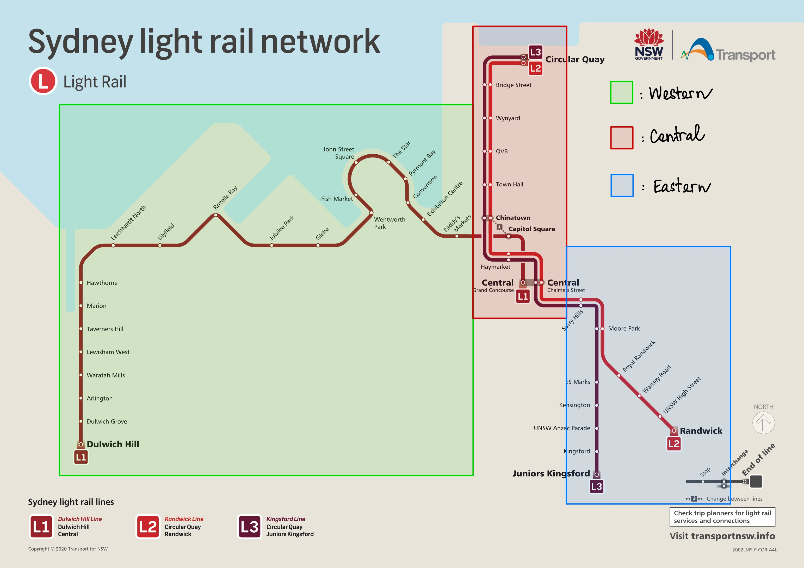

# **Evaluation of a potentially optimal location for an official store in Sydney**

### Project 3

### University of Sydney \| Foundation of Data Science \| May 2023

## Client

### [**Dear Klairs**](https://www.klairscosmetics.com)

-   A Korean skincare brand established in 2010
-   Currently has 1,000 distribution channels in 40 countries
-   Aims at becoming a global brand

## Recommendations

-   The proximity of light rail stations is a reasonable location for Dear Klairs' official store in Sydney.
-   Light rail stations in the middle of the Sydney light rail network appears to be the best option.
-   The second and third best choices are those in the Eastern and Western part of the network, respectively.

## Evidence

```{r echo = FALSE, message = FALSE}
library(dplyr)

# Reading data and removing data of unknown locations
data <- read.csv('LightRail_Jan2023.csv')
data <- filter(data, data$Location!='UNKNOWN')
data <- filter(data, Location == 'Dulwich Hill Light Rail' |
                 Location == 'Dulwich Grove Light Rail' |
                 Location == 'Arlington Light Rail' |
                 Location == 'Waratah Mills Light Rail' |
                 Location == 'Lewisham West Light Rail' |
                 Location == 'Taverners Hill Light Rail' |
                 Location == 'Marion Light Rail' |
                 Location == 'Hawthorne Light Rail' |
                 Location == 'Leichhardt North Light Rail' |
                 Location == 'Lilyfield Light Rail' |
                 Location == 'Rozelle Bay Light Rail' |
                 Location == 'Jubilee Park Light Rail' |
                 Location == 'Glebe Light Rail' |
                 Location == 'Wentworth Park Light Rail' |
                 Location == 'Fish Market Light Rail' |
                 Location == 'John Street Square Light Rail' |
                 Location == 'The Star Light Rail' |
                 Location == 'Pyrmont Bay Light Rail' |
                 Location == 'Convention Light Rail' |
                 Location == 'Exhibition Centre Light Rail' |
                 Location == 'Paddy\'s Market Light Rail' |
                 Location == 'Surry Hills Light Rail' |
                 Location == 'Moore Park Light Rail' |
                 Location == 'Royal Randwick Light Rail' |
                 Location == 'Wansey Road Light Rail' |
                 Location == 'UNSW High Street Light Rail' |
                 Location == 'ES Marks Light Rail' |
                 Location == 'Kensington Light Rail' |
                 Location == 'UNSW Anzac Parade Light Rail' |
                 Location == 'Kingsford Light Rail' |
                 Location == 'Randwick Light Rail' |
                 Location == 'Juniors Kingsford Light Rail'|
                 Location == 'Surry Hills Light Rail' |
                 Location == 'Moore Park Light Rail' |
                 Location == 'Royal Randwick Light Rail' |
                 Location == 'Wansey Road Light Rail' |
                 Location == 'UNSW High Street Light Rail' |
                 Location == 'ES Marks Light Rail' |
                 Location == 'Kensington Light Rail' |
                 Location == 'UNSW Anzac Parade Light Rail' |
                 Location == 'Kingsford Light Rail' |
                 Location == 'Randwick Light Rail' |
                 Location == 'Juniors Kingsford Light Rail'|
                 Location == 'Bridge Street Light Rail' |
                 Location == 'Capitol Square Light Rail' |
                 Location == 'Central Chalmers Street Light Rail' |
                 Location == 'Central Grand Concourse Light Rail' |
                 Location == 'Chinatown Light Rail' |
                 Location == 'Circular Quay Light Rail' |
                 Location == 'Wynyard Light Rail' |
                 Location == 'QVB Light Rail' |
                 Location == 'Town Hall Light Rail' |
                 Location == 'Haymarket Light Rail')
```

### [The Data](https://opendata.transport.nsw.gov.au/dataset/opal-trips-light-rail)

-   47 light rail stations from opendata.transport.nsw.gov.au, with 3 variables in consideration:
    -   Month and Year recorded
    -   Name of the light rail stations
    -   Trips
-   Closed light rail stations were excluded, considering only the stations which are currently operated

### Is the number of people accessing light rail affected by the temperature?

```{r message=FALSE, echo = FALSE}
# Create a new data frame recording the monthly total trips in each light rail
i <- 1
df <- data.frame(year_month = '', location = '', total_trip = 0)
while (i <= dim(data)[1]) {
  if (i == 1) {
    total <- data$Trip[i]
    year <- data$Year_Month[i]
    loc <- data$Location[i]
  }
  else if (data$Location[i] == data$Location[i-1]) {
    total <- total + data$Trip[i]
  }
  else if (data$Location[i] != data$Location[i-1]) {
    df <- add_row(df, year_month = year, location = loc, total_trip = total)
    total <- data$Trip[i]
    year <- data$Year_Month[i]
    loc <- data$Location[i]
  }
  if (i == dim(data)[1]) {
    total <- total + data$Trip[i]
    df <- add_row(df, year_month = year, location = loc, total_trip = total)
  }
  i <- i + 1
}

# Divide the data into average trips during warm and cold months
df <- filter(df, location != '')
warm <- filter(df, substr(df$year_month, 6, 7) == '03' | 
                 substr(df$year_month, 6, 7) == '10' |
                 substr(df$year_month, 6, 7) == '11' |
                 substr(df$year_month, 6, 7) == '12' |
                 substr(df$year_month, 6, 7) == '01' |
                 substr(df$year_month, 6, 7) == '02')
warm <- filter(warm, warm$total_trip > 10)
df_warm <- data.frame(year_month = '', avg_trips = 0)
i <- 1
while (i <= dim(warm)[1]) {
  if (i == 1) {
    mean_trips <- warm$total_trip[i]
  }
  else if (warm$year_month[i] == warm$year_month[i-1]) {
    mean_trips <- mean(mean_trips, warm$total_trip[i])
  }
  else if (warm$year_month[i] != warm$year_month[i-1]) {
    df_warm <- add_row(df_warm, year_month = warm$year_month[i-1], avg_trips = mean_trips)
    mean_trips <- warm$total_trip[i]
  }
  if (i == dim(warm)[1]) {
    mean_trips <- mean(mean_trips, warm$total_trip[i])
    df_warm <- add_row(df_warm, year_month = warm$year_month[i], avg_trips = mean_trips)
  }
  i <- i + 1
}
df_warm <- slice(df_warm, -1)

cold <- filter(df, substr(df$year_month, 6, 7) == '04' |
                 substr(df$year_month, 6, 7) == '05' |
                 substr(df$year_month, 6, 7) == '06' |
                 substr(df$year_month, 6, 7) == '07' |
                 substr(df$year_month, 6, 7) == '08' |
                 substr(df$year_month, 6, 7) == '09')
cold <- filter(cold, cold$total_trip > 10)
df_cold <- data.frame(year_month = '', avg_trips = 0)
i <- 1
while (i <= dim(cold)[1]) {
  if (i == 1) {
    mean_trips <- cold$total_trip[i]
  }
  else if (cold$year_month[i] == cold$year_month[i-1]) {
    mean_trips <- mean(mean_trips, cold$total_trip[i])
  }
  else if (cold$year_month[i] != cold$year_month[i-1]) {
    df_cold <- add_row(df_cold, year_month = cold$year_month[i-1], avg_trips = mean_trips)
    mean_trips <- cold$total_trip[i]
  }
  if (i == dim(cold)[1]) {
    mean_trips <- mean(mean_trips, cold$total_trip[i])
    df_cold <- add_row(df_cold, year_month = cold$year_month[i], avg_trips = mean_trips)
  }
  i <- i + 1
}
df_cold <- slice(df_cold, -1)

# Perform 2-sample t-test
test <- t.test(df_warm$avg_trips, df_cold$avg_trips, var.equal = TRUE)

# Create a table to present the test result
library(basictabler)
months <- c('Warm months (October - March)', 'Cold months (April - September)')
number <- c(dim(df_warm)[1], dim(df_cold)[1])
avg_trips <- c(round(mean(df_warm$avg_trips),2), round(mean(df_cold$avg_trips)[1], 2))
p <- round(test$p.value,2)
simpleBlueTheme <- list(
  fontName="Verdana, Arial",
  fontSize="0.75em",
  headerBackgroundColor = "rgb(100, 149, 237)",
  headerColor = "rgb(255, 255, 255)",
  cellBackgroundColor = "rgb(255, 255, 255)",
  cellColor = "rgb(0, 0, 0)",
  totalBackgroundColor = "rgb(186, 202, 233)",
  totalColor = "rgb(0, 0, 0)",
  borderColor = "rgb(25, 25, 112) ")

tbl <- BasicTable$new()
tbl$addData(data.frame(months, number, avg_trips, p), 
            firstColumnAsRowHeader = TRUE, 
            explicitColumnHeaders = c('Months', 'Number of Samples', 'Average light rail trips', 'p-value'), 
            columnFormats=list(NULL, NULL, NULL, "%.2f"))
tbl$theme <- c('largeplain', simpleBlueTheme)
tbl$renderTable(styleNamePrefix="t2")
```

###################### *Table 1: Welch's Test on The difference between Average Light Rail Trips in Low and High Temperature*

####  {.tabset}

##### Analysis

-   Based on the data about [weather averages by month in Sydney](https://en.climate-data.org/oceania/australia/new-south-wales/sydney-24/#:~:text=Data%20and%20graphs%20for%20weather%20%26%20climate&text=The%20rainfall%20in%20Sydney%20is,mm%20%7C%2035.9%20inch%20per%20year), the given data set is separated concerning the reported month of each object. Specifically, April, May, June, July, August, and October are considered low-temperature months, and the remaining are high-temperature.
-   A Welch's Test was then performed to verify whether there is any difference between warm and cool months in their average light rail trips, with a p-value \< 0.05 recognized as statistically significant.
-   Regarding the result shown in Table 1, it seems evidence that, with a significant p-value of approximately 0.89, the temperature only has a negligible effect on the number of people travelling by light rail.
-   Therefore, a store located near a light rail station appears to have a stable presence to the public.

##### Technical Notes

-   Hypothesis:
    -   H~0~: warm months' average light rail trips - cold months' average light rail trips = 0
    -   H~1~: warm months' average light rail trips - cold months' average light rail trips ≠ 0
-   Significance level: 0.05
-   p-value: 0.89 \> 0.05

-\> H~0~ is retained

### Which part of the light rail network in Sydney is the most crowded?

-   The light rail network in Sydney is divided into three parts: Western, Central, and Eastern as demonstrated in Figure 1.



```{r message = FALSE, echo = FALSE}
library(ggplot2)
library(dplyr)

west <- filter(df, location == 'Dulwich Hill Light Rail' |
                 location == 'Dulwich Grove Light Rail' |
                 location == 'Arlington Light Rail' |
                 location == 'Waratah Mills Light Rail' |
                 location == 'Lewisham West Light Rail' |
                 location == 'Taverners Hill Light Rail' |
                 location == 'Marion Light Rail' |
                 location == 'Hawthorne Light Rail' |
                 location == 'Leichhardt North Light Rail' |
                 location == 'Lilyfield Light Rail' |
                 location == 'Rozelle Bay Light Rail' |
                 location == 'Jubilee Park Light Rail' |
                 location == 'Glebe Light Rail' |
                 location == 'Wentworth Park Light Rail' |
                 location == 'Fish Market Light Rail' |
                 location == 'John Street Square Light Rail' |
                 location == 'The Star Light Rail' |
                 location == 'Pyrmont Bay Light Rail' |
                 location == 'Convention Light Rail' |
                 location == 'Exhibition Centre Light Rail' |
                 location == 'Paddy\'s Market Light Rail')
west <- filter(west, substr(year_month, 1, 4) != '2016' &
                 substr(year_month, 1, 4) != '2017' &
                 substr(year_month, 1, 4) != '2018' &
                 substr(year_month, 1, 4) != '2019' &
                 substr(year_month, 1, 4) != '2023')

east <- filter(df, location == 'Surry Hills Light Rail' |
                 location == 'Moore Park Light Rail' |
                 location == 'Royal Randwick Light Rail' |
                 location == 'Wansey Road Light Rail' |
                 location == 'UNSW High Street Light Rail' |
                 location == 'ES Marks Light Rail' |
                 location == 'Kensington Light Rail' |
                 location == 'UNSW Anzac Parade Light Rail' |
                 location == 'Kingsford Light Rail' |
                 location == 'Randwick Light Rail' |
                 location == 'Juniors Kingsford Light Rail')
east <- filter(east, substr(year_month, 1, 4) != '2019' &
                 substr(year_month, 1, 4) != '2023')

cbd <- filter(df, location == 'Bridge Street Light Rail' |
                location == 'Capitol Square Light Rail' |
                location == 'Central Chalmers Street Light Rail' |
                location == 'Central Grand Concourse Light Rail' |
                location == 'Chinatown Light Rail' |
                location == 'Circular Quay Light Rail' |
                location == 'Wynyard Light Rail' |
                location == 'QVB Light Rail' |
                location == 'Town Hall Light Rail' |
                location == 'Haymarket Light Rail')
cbd <- filter(cbd, substr(year_month, 1, 4) != '2016' &
                 substr(year_month, 1, 4) != '2017' &
                 substr(year_month, 1, 4) != '2018' &
                 substr(year_month, 1, 4) != '2019' &
                 substr(year_month, 1, 4) != '2023')

west_monthly <- data.frame(year_month = '', monthly_avg_trip = 0)
i <- 1
while (i <= dim(west)[1]) {
  if (i == 1) {
    avg_trip <- west$total_trip[i]
  }
  else if (west$year_month[i] == west$year_month[i-1]) {
    avg_trip <- mean(avg_trip, west$total_trip[i])
  }
  else if (west$year_month[i] != west$year_month[i-1]) {
    west_monthly <- add_row(west_monthly, year_month = west$year_month[i-1], monthly_avg_trip = avg_trip)
    avg_trip <- west$total_trip[i]
  }
  if (i == dim(west)[1]) {
    west_monthly <- add_row(west_monthly, year_month = west$year_month[i], monthly_avg_trip = avg_trip)
  }
  i <- i + 1
}
west_monthly <- slice(west_monthly, -1)

east_monthly <- data.frame(year_month = '', monthly_avg_trip = 0)
i <- 1
while (i <= dim(east)[1]) {
  if (i == 1) {
    avg_trip <- east$total_trip[i]
  }
  else if (east$year_month[i] == east$year_month[i-1]) {
    avg_trip <- mean(avg_trip, east$total_trip[i])
  }
  else if (east$year_month[i] != east$year_month[i-1]) {
    east_monthly <- add_row(east_monthly, year_month = east$year_month[i-1], monthly_avg_trip = avg_trip)
    avg_trip <- east$total_trip[i]
  }
  if (i == dim(east)[1]) {
    east_monthly <- add_row(east_monthly, year_month = east$year_month[i], monthly_avg_trip = avg_trip)
  }
  i <- i + 1
}
east_monthly <- slice(east_monthly, -1)

cbd_monthly <- data.frame(year_month = '', monthly_avg_trip = 0)
i <- 1
while (i <= dim(cbd)[1]) {
  if (i == 1) {
    avg_trip <- cbd$total_trip[i]
  }
  else if (cbd$year_month[i] == cbd$year_month[i-1]) {
    avg_trip <- mean(avg_trip, cbd$total_trip[i])
  }
  else if (cbd$year_month[i] != cbd$year_month[i-1]) {
    cbd_monthly <- add_row(cbd_monthly, year_month = cbd$year_month[i-1], monthly_avg_trip = avg_trip)
    avg_trip <- cbd$total_trip[i]
  }
  if (i == dim(cbd)[1]) {
    cbd_monthly <- add_row(cbd_monthly, year_month = cbd$year_month[i], monthly_avg_trip = avg_trip)
  }
  i <- i + 1
}
cbd_monthly <- slice(cbd_monthly, -1)

all <- data.frame(year_month = west_monthly$year_month, west = west_monthly$monthly_avg_trip, east = east_monthly$monthly_avg_trip, center = cbd_monthly$monthly_avg_trip)

fig <- ggplot(all, aes(x = west_monthly$year_month)) +
  geom_line(aes(y = west_monthly$monthly_avg_trip, color = 'Western', group = 1)) +
  geom_line(aes(y = east_monthly$monthly_avg_trip, color = 'Eastern', group = 1)) +
  geom_line(aes(y = cbd_monthly$monthly_avg_trip, color = 'Central', group = 1)) + 
  scale_x_discrete(breaks = c('2020-01', '2020-07', '2021-01', '2021-07', '2022-01', '2022-07', '2022-12')) +
  labs(x = 'Month - Year',
       y = 'Monthly Average Light Rail Trips',
       title = 'Figure 2: Average Light Rail Trips in Three Areas of the Sydney\'s Light Rail System',
       color = 'Location') + 
  scale_color_manual(values = c('red', 'blue', 'green')) +
  theme(plot.title.position = 'panel')
```

```{r echo=FALSE, message=FALSE}
fig
```

-   As can be observed in Figure 2, light rail stations in all regions experienced a similar trend from January 2020 to the end of 2022.
-   However, regardless of the changing pattern, light rail stations in the center remain to be the most crowded, with the average trips almost triple that of the counterpart in the East - the second most crowded area - in December 2022. By contrast, the Western side of the system saw the smallest number of people during the period examined.\
-   Hence, the Central, Eastern, and Western light rail stations appear to be the first, second, and third best choices for an official store regarding brand awareness.

## Acknowledgements

Data transformation with dplyr cheatsheet. (2021, January 7). Posit. Retrieved May 21, 2023, from <https://posit.co/wp-content/uploads/2022/10/data-transformation-1.pdf>

Data visualization with ggplot2 cheatsheet. (2021, January 8). Posit. Retrieved May 21, 2023, from <https://posit.co/wp-content/uploads/2022/10/data-visualization-1.pdf>

Dear, Klairs. (2023, March 31). Dear, Klairs \| Vegan-Friendly, Cruelty-Free, Korean Skincare. <https://www.klairscosmetics.com/>

Dynamic documents with rmarkdown cheatsheet. (2021, January 8). Posit. Retrieved May 21, 2023, from <https://posit.co/wp-content/uploads/2022/10/rmarkdown-1.pdf>

Ed Discussion #1021. (2023, May). Edstem.org. Retrieved May 21, 2023, from <https://edstem.org/au/courses/10756/discussion/1347688>

Laherty, J. (2022). Evaluation of Top Performing Publishing Houses Since 2000. Retrieved May 21, 2023, from <https://canvas.sydney.edu.au/courses/48435/files/29946345?wrap=1>

Light Rail Network Map \| TfNSW Open Data Hub and Developer Portal. (n.d.). <https://opendata.transport.nsw.gov.au/dataset/opal-trips-light-rail/resource/58fd604c-67b6-4878-96c3-5b5c25b95cd6>

Opal Trips - Light Rail \| TfNSW Open Data Hub and Developer Portal. (n.d.). <https://opendata.transport.nsw.gov.au/dataset/opal-trips-light-rail>

Sydney climate: Average Temperature, weather by month, Sydney water temperature - Climate-Data.org. (n.d.-b). <https://en.climate-data.org/oceania/australia/new-south-wales/sydney-24/#>

Drop in session - Wednesday 17th May, 2023

DATA1001 Lecture - Topic 10: Test for Mean - Discover videos

## Appendix {.tabset}

### Client

Dear, Klairs aims to become a global skincare brand but has only one distributor in Sydney. Regarding their target, I believe they would love to have a store location that could maximize their brand awareness, thus making them a potential client for my research. Considering Dear, Klairs as my client, I have provided evidence on the stable access to Sydney light rail stations, which seems unreadily available for such a Korean brand. I have also utilized less technical language in this report to make it understandable for this cosmetic firm.

### Statistical Analytics

-   Welch's Test is utilized because:

    -   The variance test in Table 2 demonstrated that the average light rail trips during cold and warm months have equal spreads.

    ```{r message = FALSE, echo = FALSE}
    tbl1 <- BasicTable$new()
    vary <- var.test(df_warm$avg_trips, df_cold$avg_trips)
    p_vary <- round(vary$p.value, 2)
    tbl1$addData(data.frame(months, number, avg_trips, p_vary), 
                firstColumnAsRowHeader = TRUE, 
                explicitColumnHeaders = c('Months', 'Number of Samples', 'Average light rail trips', 'p-value'), 
                columnFormats=list(NULL, NULL, NULL, "%.2f"))
    tbl$theme <- c('largeplain', simpleBlueTheme)
    tbl$renderTable(styleNamePrefix="t2")
    ```

    ###################### *Table 2: Variance Test on the Spread of the Average Light Rail Trips in Cold and Warm months*

    -   The number of people accessing light rail during cold seasons does not affect their warm-season counterparts and vice versa.
    -   Due to the Central Limit Theorem, the distribution is normal in both cold and warm months.

-   A line graph is suitable for comparing objects through a period of time.

### Limitations

-   Inconsistent tapping behaviors could lead to the incompleteness of the data.
-   The actual daily temperature might be inconsistent with the assumed monthly average temperature.
